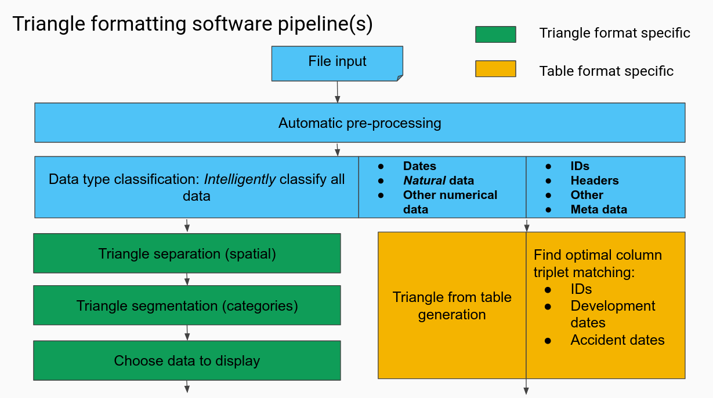

This packages has three Parts:

1 python_back_end (python, can run independently)
2 front_end (react, provides a click through front-end)
3 django-APIs (python-django, couples back and front end)

============ python_back_end ==============

Runs on python 3.6, preferably with a virtualenv. All dependencies are in requirements.txt and downloaded with 

pip install -r requirements.txt

Reads files with utilities/sheet_io.py which calls a small java software running Apache POI.

Uses an internal storage representation of Excel sheets (utilities/state_handling.py: DataStruct), which holds two pandas dataframes: one with the data and one with the data types read in the excel sheet. Both are mutable.

A bundle of DataStructs is held by a DataHolder (utilities/state_handling.py: DataHolder).

Processing an excel is done in two stages: 1) Unification: the excel is brokwn down in "unit triangles" that only hold data relevant to one category of output. Rendering: the unit triangles are selected for roles in the output, either automatically or with support from the front-end.

Unification is done in pipelines (triangle_formatting/triangle_pipeline.py), which consists of a sequence of operations with DataHolders as input and output. Each DataHolder operation is encapsulated by a DataHolderCallEncapsulator. The encapsulation makes it easy to implement new encapsulations that help in testing and benchmarking the calls separately, more about this later. Two pipelines are currently implemented: One for excels in "triangle form" and one for triangles in "table form".

Rendering does three things, distribute unit triangles to output cards (triangle_formatting/triangle_rendering.py: RowParser.set_card_ids) (non-trivial in some cases when multiple outputs are requested), distribute the right unit triangle in the right place within one output card (triangle_formatting/triangle_utils: InputMatcher.match_triangles_to_output), render the final output (triangle_formatting/triangle_rendering.py: RowParser.parse_output_from_triangle_forms)

Most testing is done via fixtures, that have been removed for copyright reasons. To make new fixtures, put the raw excel file in resources/raw_test_files and reference them in python_back_end/pipeline_fixture.py or table_triangle_fixture.py. Within the fixture files, choose how to proceed with the fixture testing by choosing different encapsulations. After the first run, the output to fix to will be saved in resources/temp. If the fixure is correct after inspection, move the file from resources/temp to resources/test to use it as automatic fixture. OBSERVE: at the moment the fixure targets have to be in .xls and not .xlsx, due to limitation in the python writing functionality. By choosing different DataHolderCallEncapsulator it is also possible to make fixtures after each DataHolder call, which is saved in pickle files. 

============ front_end ==============

front_end is a state less react program, preferably installed with npm.

npm install 

to get the right modules and

npm run dev

to start the server. The default address is http://localhost:8080

============ django-APIs ==============

django-APIs handles communication between front and back end. To start the API server run

python manage.py runserver

